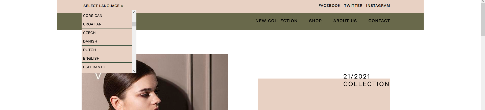
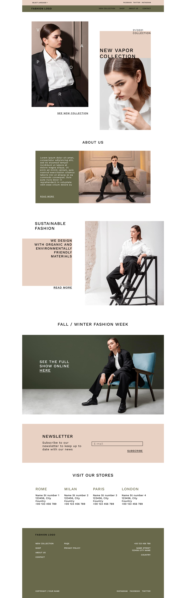
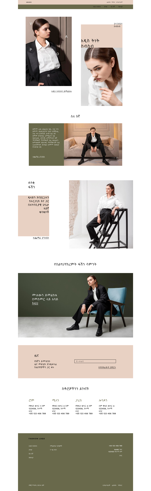
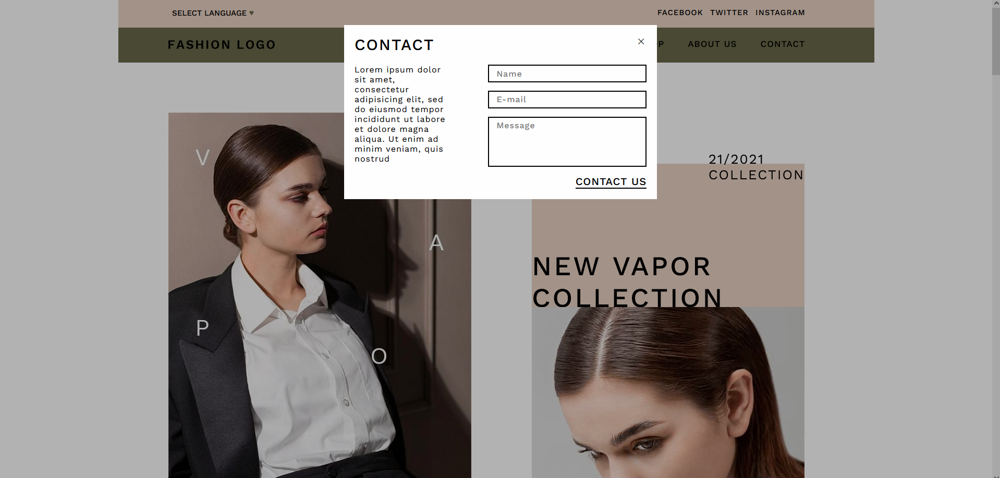
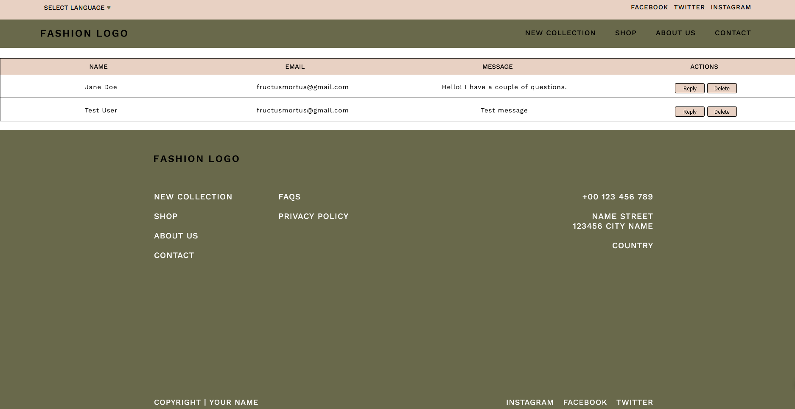
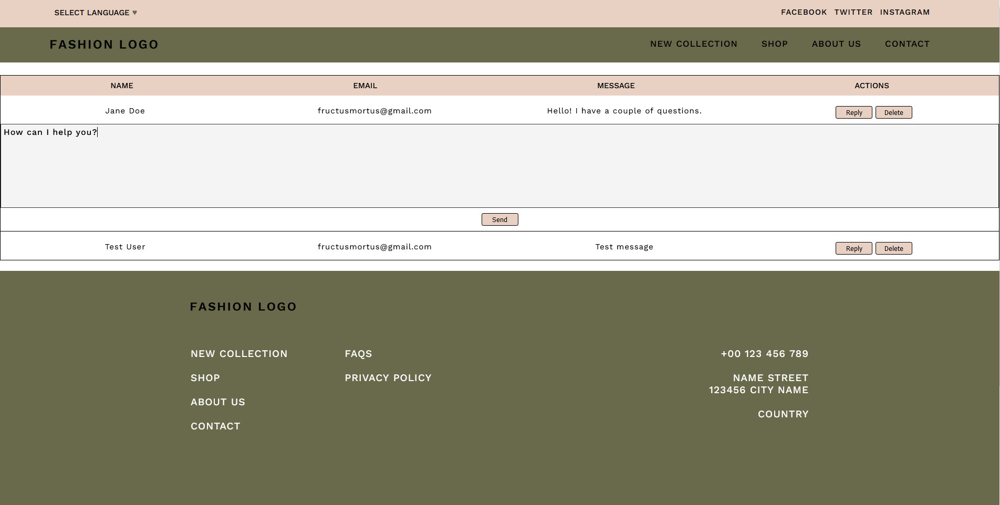
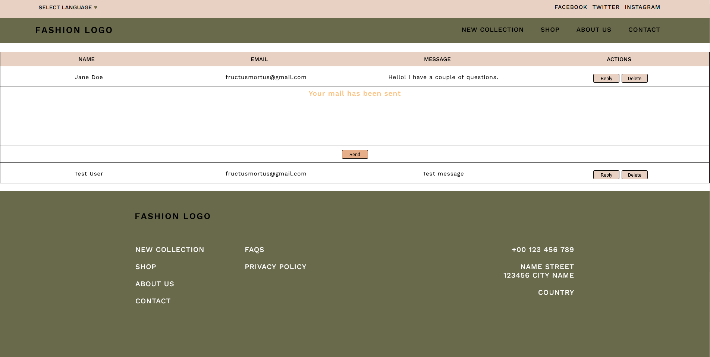
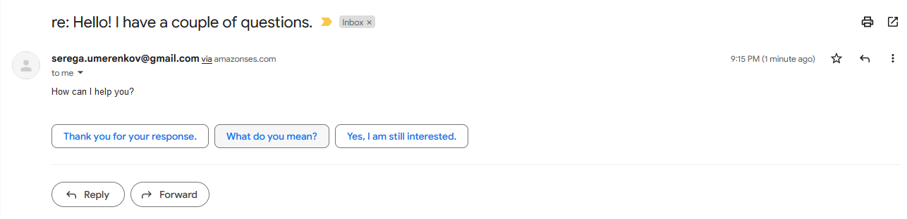

# Fashion

## Table of contents
- [Fashion](#fashion)
  - [Table of contents](#table-of-contents)
  - [Info](#info)
  - [Technologies](#technologies)
  - [Setup](#setup)
  - [Screenshots](#screenshots)

## Info
It is an educational project, which was started with **HTML+SCSS** and as result a landing page was created. After that we breathed life in it with vanilla **JS**(to feel the taste of the old web dev.), **Node** plus **Express** as our backend and added some **EJS**. Then we decided to explore some api and here we connected **google-translate-api** in order to translate content to any language. Also we observed necessity of database and some public email service, as parts of functionality of a contact form and stopped on **MySQL** and **AWS SES**. Firstly, with an ajax request the data from the contact form is being saved in a database. Secondly, at an admin page that data automatically populated from the database and displayed in a table. Finally, it can be answered or deleted.
	
## Technologies
Project was created with:
* Node.js
* MySQL
* express
* ejs
* google-cloud/translate
* aws-sdk
	
## Setup
To run this project:

```
$ docker-compose -f docker-compose.builder.yml run --rm install
$ docker-compose up
```
## Screenshots
*Dropdown with languages list*

*Original English*

*Translated to Amharic*

*Contact form*

*Admin page - an overall view*

*Admin page with an opened response form*

*Admin page - a response has been sent*

*The response was delivered*

