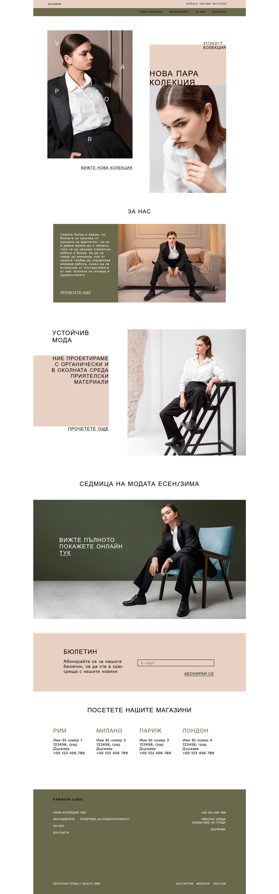

# Fashion

## Table of contents
- [Fashion](#fashion)
  - [Table of contents](#table-of-contents)
  - [General info](#general-info)
  - [Technologies](#technologies)
  - [Setup](#setup)
  - [Screenshots](#screenshots)

## General info
It is an educational project aimed to studying JS. Here we connected google-translate-api in order to translate content to any language and used Amazon SES to send emails.   
	
## Technologies
Project was created with:
* Node.js: 16.15.1
* MySQL: 2.18.1
* express: 4.17.3
* ejs: 3.1.6
* google-cloud/translate: 6.3.1
* vitalets/google-translate-api: 8.0.0
* aws-sdk: 2.1110.0
	
## Setup
To run this project:

```
$ docker-compose -f docker-compose.builder.yml run --rm install
$ docker-compose up
```
## Screenshots




