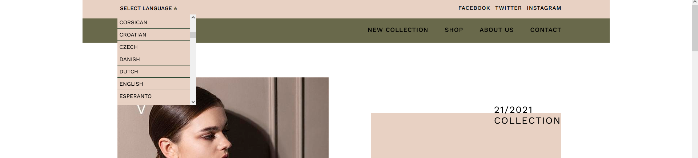
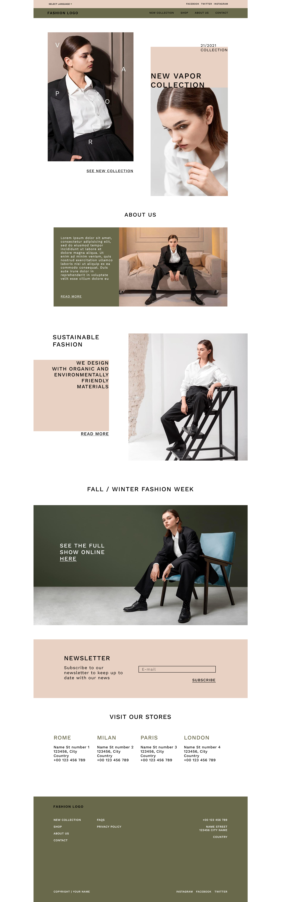
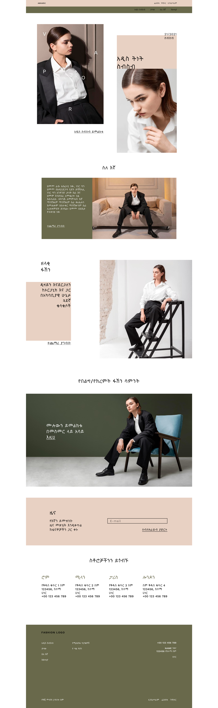
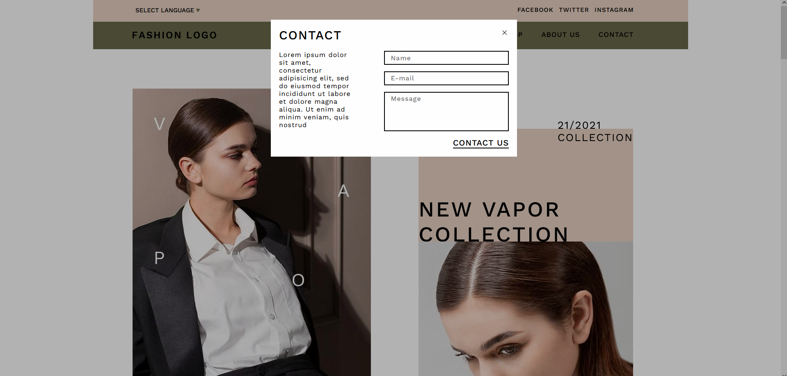
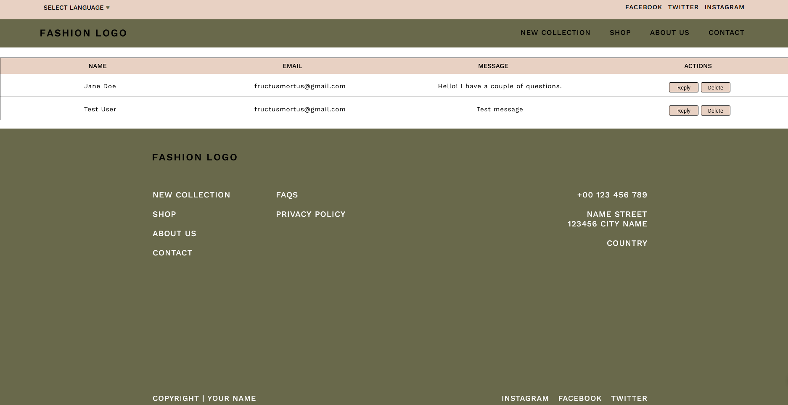
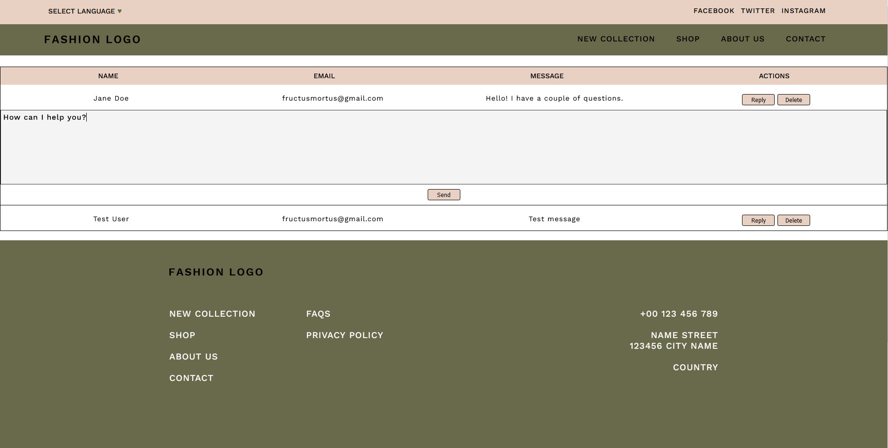
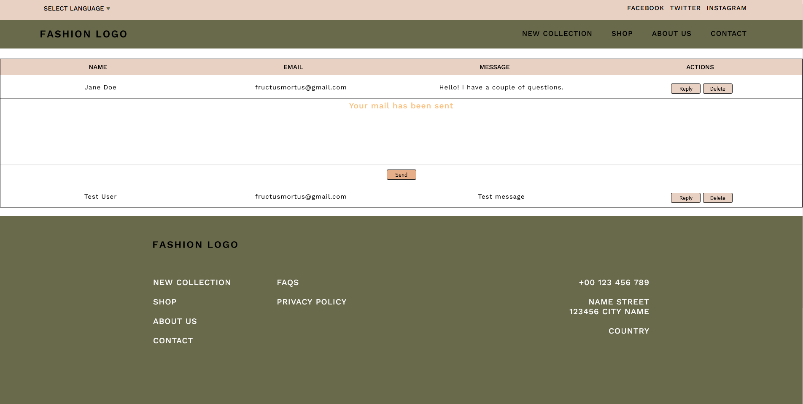
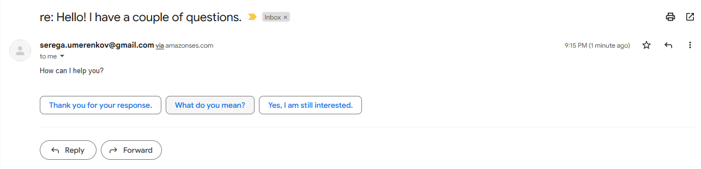

# Fashion

## Table of contents
- [Fashion](#fashion)
  - [Table of contents](#table-of-contents)
  - [Info](#info)
  - [Technologies](#technologies)
  - [Setup](#setup)
  - [Screenshots](#screenshots)

## Info
That module is dedicated to practicing with jQuery. It's the same as the module-1 but the whole vanilla JS code was refactored with introduction of jQuery if possible. The main goal was to follow the path of old generations of developers and to feel the difference between pure JS and some technologie which helps to simplify the code. jQuery was chosen as one of the most popular libraries a few time ago and as it can be foundable in many projects even today. 

In the project we used **HTML+SCSS**, **Node** plus **Express** as our backend and added some **EJS**. We have used the API and here we have included **google-translate-api** to translate content into any language. We also noted the need for a database and some public email service as part of the contact form functionality, and settled on **MySQL** and **AWS SES**. Firstly, during an ajax request, the data from the contact form is stored in the database. Secondly, on the admin page, data is automatically populated from the database and displayed in a table. Finally, it can be answered or deleted.
	
## Technologies
Project was created with:
* jQuery
* Node.js
* MySQL
* express
* ejs
* google-cloud/translate
* aws-sdk
	
## Setup
To run this project:

```
$ docker-compose -f docker-compose.builder.yml run --rm install
$ docker-compose up
```
## Screenshots
*Dropdown with languages list*

*Original English*

*Translated to Amharic*

*Contact form*

*Admin page - an overall view*

*Admin page with an opened response form*

*Admin page - a response has been sent*

*The response was delivered*

